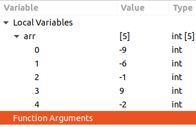

# Лабораторна робота №7. Функції.
## Вимоги:
* *Розробник*: Зозуля Ігор
* *Загальне завдання*: Реалізувати програму з використанням функцій.
* *Індивідуальне завдання* : Відсортувати масив в залежності від флагу.
## Опис програми:
* *Функціональне призначення* : Сортування масиву в залежності від флагу. Кількість елементів більше одиниці, і всі елементи мають ціле значення.

* *Опис логічної структури* :
   * Функція `main`. Формує масив с заданої кількості елементів з випадковими значенями від -10 до 10. Викликає функцію `sort_array`. Схема алгоритму функції:

     
     
   * Функція `sort_array`. Сортує масив методом "бульбашки". Параметри: n - розмір масиву; arr - масив; flag: true - від меншого до більшого, false - від більшого до меншого. Схема алгоритму функції:
   
     
   
* *Структура програми*:
```
   .
        └── lab07/
            ├── Doxyfile
            ├── Makefile
            ├── README.md
            ├── doc/
            │   ├── labXX.md
            │   └── labXX.pdf
            ├── src/
                └── main.c
```
* *Важливі елементи програми*:
   * Формування масиву. Формуємо масив з n елементів с завідомо відомими значеннями.
   ```
   #define N 5
        int arr[N];
        for (int i = 0; i < N; i++) {
                arr[i] = rand() % 21 - 10;
        }
   ```
   *  Обмін значеннями двух елементів масиву. Міняємо значення змінних, за допомогою третьої змінної.
   ```
   int temp = num[j - 1];
   num[j - 1] = num[j];
   num[j] = temp;
   ```
## Варіанти використання:
З допомогою відлогаднику ставимо точку зупинки на строках визову функції (для визначення початкового стану масиву)  та `return 0;` (для визначення стану выдсортованого масиву).
Виклик функції sort_array з початковими данними:



З флагом `true`:


З флагом `false`:


## Висновки:
Для виконання лабораторної роботи я навчився створювати та реалізовувати алгоритми вункції, створювати схеми алгоритмів, та оформлювати документацію.
